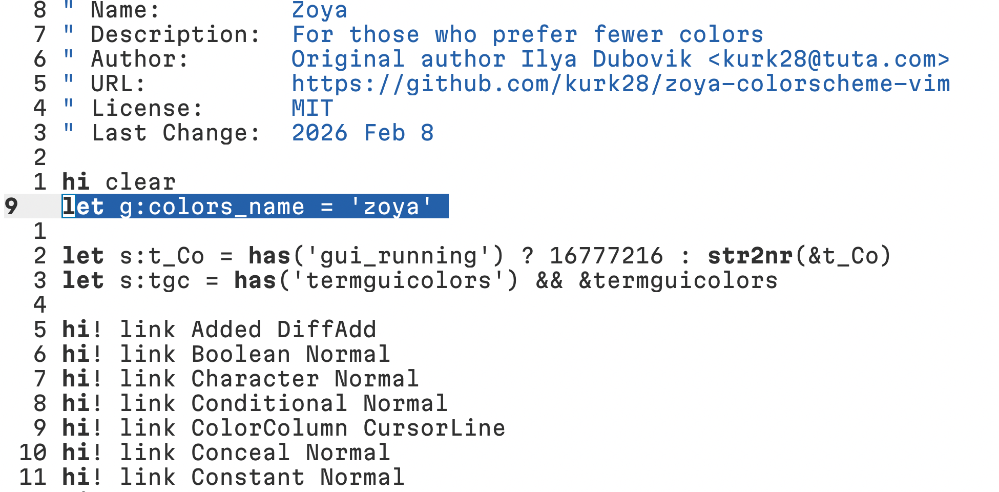
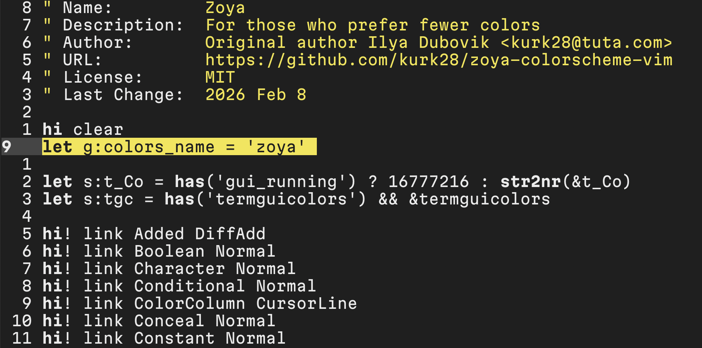

# Zoya Colorscheme

Light and dark colorscheme with minimal colors for Vim.

## Motivation

I created Zoya colorscheme for personal usage, because I was not able to find a
colorscheme with minimum colors and good enough contrast for me (>75 APCA level).
A lot of colored text distracts me and low contrast levels don’t let me
read text correctly with my vision. Additionally, I challenged myself to not use
colors that are hard to distinguish for colorblindness (protanope, deuteranope,
tritanope).

## Specificity

1. Colorscheme main colors have APCA level above 90, but less than 100
2. Comments are highlighted (>70 APCA level), I usually read them
3. Functions have a bold font, I look at them as the most important parts of a program
4. Statements have a bold font
5. Errors have a bold and underlined font
6. Warnings have an underlined font
7. A specific group has an italic font 

## Installation

Place the zoya.vim file into the colors folder within your Vim directory, e.g. ~/.vim/colors

```bash
    git clone https://github.com/kurk28/zoya-colorscheme-vim.git
    cd zoya-colorscheme-vim
    cp zoya.vim ~/.vim/colors
```

## Resources

1. [Color Universal Design](https://jfly.uni-koeln.de/color/)
2. [Myndex](https://gist.github.com/Myndex)
3. [A Physiologically-based Model for Simulation of Color Vision Deficiency
](https://www.inf.ufrgs.br/~oliveira/pubs_files/CVD_Simulation/CVD_Simulation.html)

## Additional information

I use the [Mono font](https://github.com/evilmartians/mono) from Evil Martians
without ligatures. 

## Screenshots





## License

[MIT License](https://github.com/kurk28/zoya-colorscheme-vim/blob/master/LICENSE)


 
